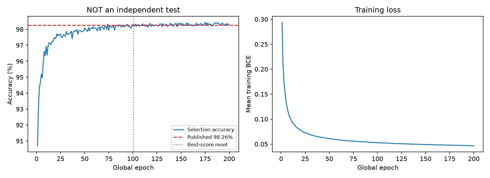

# Pollen training-protocol reproduction

Full 2 x 100 epoch protocol run. One seed (42), cpu, trained from scratch.
Generated from saved predictions; no robot, calibration or DAC involved.

中文摘要：本次模型选择集准确率为 **98.4346%**，
与发布者的 98.26% 相差 **+0.1746 个百分点**。滑移 F1 为 **0.9436**。
该集合参与了模型选择，**不是独立测试成绩，也不代表未见物体或真实机器人性能**。

## Result

| Metric | This local run |
|---|---:|
| Upstream model-card accuracy | 98.26% |
| Local selection-set accuracy | 98.4346% |
| Difference (local minus published) | +0.1746 percentage points |
| Slip precision | 0.9709 |
| Slip recall | 0.9177 |
| Slip F1 | 0.9436 |
| Average precision | 0.9820 |
| Majority no-slip accuracy | 85.7389% |
| Selected global epoch (phase-2 best) | 175 / 200 |
| Parameters | 90,881 |
| Training + per-epoch evaluation | 10.90 minutes |

Confusion matrix, rows = true [no slip, slip], columns = predicted [no slip, slip]:

| | Predicted no slip | Predicted slip |
|---|---:|---:|
| True no slip | 21754 | 100 |
| True slip | 299 | 3336 |

These are checkpoint-selection scores, NOT an independent final test. Closeness
to 98.26% is a numerical comparison only, not proof of exact published-run replication.
The publisher does not identify the initialization seed, full runtime environment,
dataset revision or selected epoch that produced the model-card number.

## Training history

## What was reproduced

- Pollen source commit `24a3728c35985def720ff292a8a45ef7e8662a64`.
- Pinned dataset `d9f5e315006482635a2effa34488715871d55c13`: all 17 CSVs, including `no_slip.csv`.
- Actual Hugging Face dataset loader; every row/file order verified against local CSV hashes.
- 127,445 rows: 101,956 training, 25,489 selection.
- All-data StandardScaler before random 80/20 row split, seed 42; no stratification.
- Input `[batch, 1, 15]`; no resampling or history window.
- LSTM hidden 128, then Linear 128->128 and Linear 128->1; no intervening activation.
- Batch 32, Adam 0.001, unweighted BCEWithLogitsLoss; no early stopping/clipping.
- Two consecutive 100-epoch phases, preserving model and optimizer.
  Best score resets between phases, just as in the duplicated upstream loops.
  The upstream final artifact corresponds to the best checkpoint of phase 2.
- Strict `sigmoid(logit) > 0.5` prediction threshold.

## Explicit adaptations, not silent changes

- CPU instead of upstream hard-coded CUDA; PyTorch initialization seed 42 is
  recorded because upstream does not fix one. Package versions are in `run_config.json`.
- Upstream computes augmented arrays but never uses them in training. That unused work
  is omitted; all training uses the original rows, as upstream actually does.
- Equivalent zero initial states; additional mean-loss logging and audit artifacts.
  No upstream pretrained weights are used.

## Evaluation limits

1. Random rows from the same recordings can occur in both subsets; nearby observations
   are correlated. This is not held-out-object, held-out-trial or future-time evaluation.
2. Standardisation uses selection-set features: preprocessing leakage is retained solely
   for protocol reproduction, not endorsed as good practice.
3. The set called 'test' upstream selects checkpoints every epoch. It is therefore a
   selection set; there is no untouched final test in this protocol.
4. A one-time-step LSTM does not demonstrate temporal slip-pattern learning.
5. One initialization on one split gives no uncertainty interval for model performance.
6. The earlier object-held-out baseline differs in data, split, sequence length,
   architecture and training. Its ~79% accuracy is NOT a controlled comparison.
7. These offline results do not establish SO-100/SO-101 transfer, drop-rate reduction,
   physical safety, real-time control, confidence calibration or DAC performance.

## Artifacts and sources

- `history.csv` and `training.png`: all epochs, not only the selected one.
- `per_recording.csv`: selection scores broken down by source recording (not new objects).
- `data_audit.json`: verified file order, hashes, row counts, split hashes and protocol.
- `run_config.json`, `training_summary.json`: environment and both phase-best records.
- Local weights, row indices and prediction arrays: `runs\pollen_reproduction_seed42` (Git-ignored).
- [Pinned Pollen code](https://github.com/pollen-robotics/anyskin-slip-detection/tree/24a3728c35985def720ff292a8a45ef7e8662a64)
- [Published model card](https://huggingface.co/pollen-robotics/anyskin-slip-detection)
- [Dataset](https://huggingface.co/datasets/pollen-robotics/anyskin_slip_detection)
- [Protocol explanation](../../docs/POLLEN_REPRODUCTION.md)
