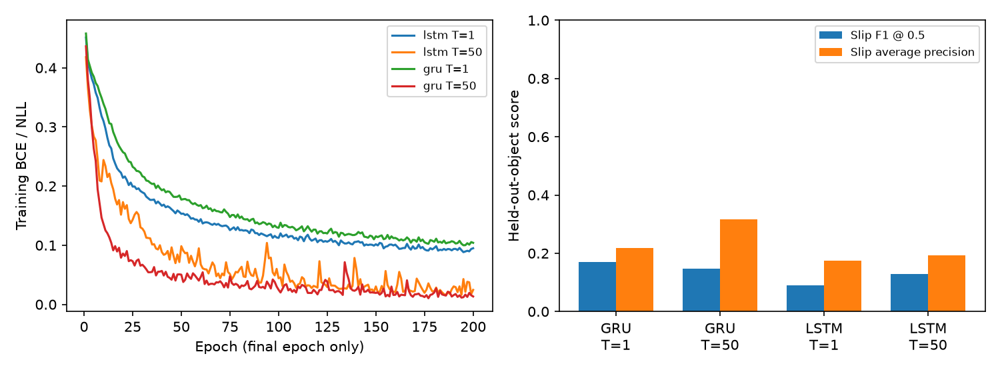

# 固定训练轮数、按物体隔离的时间窗口对照

研究问题：在同一批预测时刻上，增加磁信号历史是否改善未见物体的当前滑移识别？LSTM 与 GRU 在这一固定流程下有何差异？温度缩放是否能改善概率质量？

## 协议

- 种子 42；每个模型固定训练 200 轮，只使用最后一轮。训练期间不读取校准/测试集，不选择最佳测试 epoch。
- LSTM/GRU × 1/50 步；15 个磁信号通道；100 Hz 因果重采样；窗口步幅为 5；50 步覆盖约 0.5 秒。
- 单步输入取同一 50 步窗口的最后一行。因此四组的样本、标签、预测时刻及批次顺序完全对应，历史长短不改变样本数量。
- hidden size 128，同样的两层线性输出头（无中间激活）；Adam，学习率 0.001，batch size 32，无类别加权。相同隐藏宽度不代表 LSTM 与 GRU 参数量相同。
- 不跨文件、时间倒退或超过 0.1 秒的采样间隔构造窗口。标准化只使用训练物体的独立重采样行拟合，不重复计入重叠窗口。
- 全部物体记录按文件隔离。混合物体 no_slip.csv 不参与；划分和超参数预先固定在 protocol.json。
- 无验证集：不早停、不调阈值或超参数。原实验的验证物体并入训练。校准集仅拟合正温度 T（最小化 NLL，范围 0.05–20）。
- 预测当前窗口末端是否滑移，不是提前预测未来滑移；分类阈值固定 0.5（概率严格大于 0.5 判滑移）。

| 集合 | 物体数 | 窗口数 | 滑移占比 |
|---|---:|---:|---:|
| train | 10 | 5884 | 18.10% |
| calibration | 3 | 2041 | 14.55% |
| test | 3 | 1813 | 21.01% |

训练：apple.csv, ball.csv, book.csv, bottle.csv, cable.csv, carambole.csv, cork.csv, cream.csv, cup.csv, elastic.csv

校准：foam.csv, foam_filter.csv, gluestick.csv

测试：grappe.csv, socks.csv, tissues.csv

## 实际结果

以下均为三个测试物体全部窗口的合并指标（不是逐物体宏平均）；TS = temperature scaling。校准集拟合记录另见 run_audit.json。

| 模型 | 步数 | 参数量 | Accuracy | 滑移 F1 | AP | ECE 原始→TS | NLL 原始→TS | 温度 |
|---|---:|---:|---:|---:|---:|---:|---:|---:|
| GRU | 1 | 72321 | 75.95% | 0.1711 | 0.2191 | 0.2138→0.2318 | 3.7482→0.7036 | 11.761 |
| GRU | 50 | 72321 | 74.24% | 0.1463 | 0.3165 | 0.2311→0.0655 | 1.9800→0.5253 | 6.926 |
| LSTM | 1 | 90881 | 77.94% | 0.0909 | 0.1756 | 0.2063→0.2694 | 4.4215→0.6859 | 14.005 |
| LSTM | 50 | 90881 | 74.52% | 0.1283 | 0.1923 | 0.2435→0.1906 | 2.3325→0.6318 | 5.835 |

始终预测不滑移即可获得 **78.99% accuracy**、但滑移 F1 为 0。不能只看 accuracy。

温度缩放保持 logit 的符号和排序：阈值 0.5 的 accuracy/F1、ROC-AUC 和 AP 不变。它调整概率，不补救错误分类。ECE 使用 15 个等宽置信度区间；NLL/Brier 也在 metrics.csv 中。

### 历史长度的影响（50 步减去 1 步）

- LSTM：F1 +0.0374，AP +0.0167，accuracy -3.42 个百分点。
- GRU：F1 -0.0249，AP +0.0974，accuracy -1.71 个百分点。

这些是本次固定划分、单种子实验的观测差值，不是统计显著性或普遍优劣结论。

### 如何解读

四模型的滑移召回率范围为 5.25%–11.81%；应结合 F1/AP 而不是只看 accuracy。

仅输出训练集滑移占比的常数概率基线：测试 NLL 0.5169、ECE 0.0291、Brier 0.1668、AP 0.2101、F1 为 0。这说明低 ECE 不等于有辨别力，更不意味着安全控制能力。

AP 衡量不同分数阈值下的精确率–召回率表现；F1 在这里只衡量固定 0.5 阈值。两者变化方向可以不同。温度在校准集上按 NLL 拟合，不是按测试 ECE 拟合，所以测试 ECE 也可能恶化。

## 与前两次实验的区别

- 第一次已有 50 步、物体隔离、训练/验证/校准/测试；但没有同端点的 1 步对照，且使用较小模型和验证集早停。本次增加历史长度消融，固定 200 轮，训练物体由 8 个增加到 10 个。
- Pollen 复刻使用随机行划分、单步输入、全体数据拟合 scaler，且按名为 test 的集合选最佳轮次。本次改变了这些评估条件，但保留其 hidden size、输出头、优化器、batch size 和总训练轮数。不是逐项估计数据泄漏影响的实验。

## 如何理解 Pollen 的约 98%

上游按 test 成绩选权重，因此这个集合事实上承担模型选择功能。这样有乐观的选择偏差风险，不应称作独立最终测试准确率。这不等于结果造假，也不能断言具体高估多少。我们的复刻为 98.4346%，复现的是其选择集成绩。更换物体划分后，数据难度、分布、样本数量、预处理等同时改变，所以不能把两个准确率的差当作其高估幅度。

## 限制与结论边界

- 测试物体在本次训练和校准中未出现，但它们在本项目第一轮实验中已被评估过。这是预先固定的探索性对照，不是全新、未曾查看的盲测。
- 只有 3 个测试物体、1 个种子、1 个划分；重叠窗口高度相关，窗口数不等于独立实验次数，不能据此声称统计显著。
- 校准物体与测试物体分布不同。校准集 NLL 降低不保证测试 ECE/NLL 改善，温度达到边界也会在 run_audit.json 中保留。
- 固定 200 轮可能过拟合；遵守固定协议不等于这一轮数最佳。不根据这次测试成绩改超参数再报同一测试集的最优值。
- 单隐藏宽度而非同参数量对照；训练耗时来自并行 CPU 工作负载，不是机器人实时延迟基准。
- 公开数据来自 Pollen 的 Reachy 2/AnySkin，不是自采 SO-101 数据；不含 DAC、闭环控制、掉落率或真实机器人验证。

## 可复核产物

- [metrics.csv](metrics.csv)：四模型 × 校准前后，包括混淆矩阵、AP、NLL、Brier。
- [per_object.csv](per_object.csv)：逐测试物体表现。
- [protocol.json](protocol.json)、[data_audit.json](data_audit.json)：冻结协议、物体划分、数据哈希与数量。
- [run_audit.json](run_audit.json)、[training_history.csv](training_history.csv)：环境、初始化、最终权重哈希、训练记录、校准集 NLL。
- 大文件保留在 ../runs/ 和 ../data/，不提交 Git。来源见 [实验 README](../README.md#来源)。
